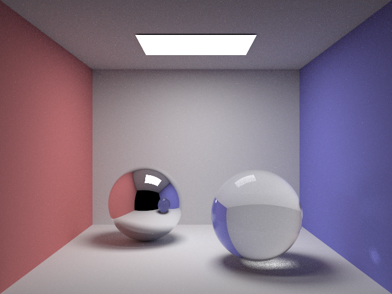

# PathTracer Overview

PathTrace is (as the name suggests) a simple path tracer that can render pictures with global illumination effects. The first part of the assignment will focus on providing an efficient implementation of **ray-scene geometry queries**. In the second half of the assignment you will **add the ability to simulate how light bounces around the scene**, which will allow your renderer to synthesize much higher-quality images. Much like in MeshEdit, input scenes are defined in COLLADA files, so you can create your own scenes for your scenes to render using free software like [Blender](https://www.blender.org/).)

Implementing the functionality of PathTracer is split in to 7 tasks, and here are the instructions for each of them:
- [(Task 1) Generating Camera Rays](camera_rays.md)
- [(Task 2) Intersecting Objects](intersecting_objects.md)
- [(Task 3) Bounding Volume Hierarchy](bounding_volume_hierarchy.md)
- [(Task 4) Shadow Rays](shadow_rays.md)
- [(Task 5) Path Tracing](path_tracing.md)
- [(Task 6) Materials](materials.md)
- [(Task 7) Environment Lighting](environment_lighting.md)

The files that you will work with for PathTracer are all under `src/student` directory. Some of the particularly important ones are outlined below. Methods that we expect you to implement are marked with "TODO (PathTracer)", which you may search for.

| File(s)  |      Purpose      |  Need to modify? |
|----------|-------------------|------------------|
| `student/pathtracer.cpp` |  This is the main workhorse class. Inside the ray tracer class everything begins with the method `Pathtracer::trace_pixel` in pathtracer.cpp. This method computes the value of the specified pixel in the output image. | Yes |
| `student/camera.cpp` | You will need to modify `Camera::generate_ray` in Part 1 of the assignment to generate the camera rays that are sent out into the scene. |  Yes |
| `student/tri_mesh.cpp`, `student/shapes.cpp` | Scene objects (e.g., triangles and spheres) are instances of the `Object` class interface defined in `rays/object.h`. You will need to implement the `bbox` and intersect routine `hit` for both triangles and spheres. |   Yes |
|`student/bvh.cpp`|A major portion of the first half of the assignment concerns implementing a bounding volume hierarchy (BVH) that accelerates ray-scene intersection queries. Note that a BVH is also an instance of the Object interface (A BVH is a scene object that itself contains other primitives.)|Yes|
|`rays/light.h`|Describes lights in the scene. The initial starter code has working implementations of directional lights and constant hemispherical lights.|No|
|`lib/spectrum.h`|Light energy is represented by instances of the Spectrum class. While it's tempting, we encourage you to avoid thinking of spectrums as colors -- think of them as a measurement of energy over many wavelengths. Although our current implementation only represents spectrums by red, green, and blue components (much like the RGB representations of color you've used previously in this class), this abstraction makes it possible to consider other implementations of spectrum in the future. Spectrums can be converted into a vector using the `Spectrum::to_vec` method.| No|
|`student/bsdf.cpp`|Contains implementations of several BSDFs (diffuse, mirror, glass). For each, you will define the distribution of the BSDF and write a method to sample from that distribution.|Yes|
|`student/samplers.cpp`|When implementing raytracing and environment light, we often want to sample randomly from a hemisphere, uniform grid, or shphere. This file contains various functions that simulate such random sampling.|Yes|

